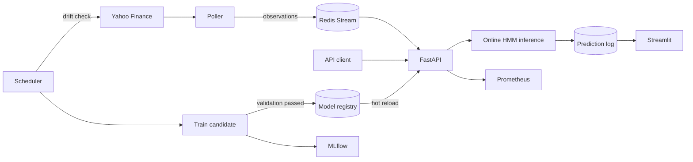

# Real-time Market Regime Detection

This project uses a Hidden Markov Model (HMM) to identify changing market
conditions from price data. It learns two hidden states from log returns and
rolling volatility, labels them `Bull` and `Bear`, and serves live regime
probabilities through a FastAPI service.

I built it to explore the gap between training a model in a notebook and
running one as a small, reliable system. Alongside the HMM itself, the project
includes streaming ingestion, model validation and promotion, drift detection,
monitoring, and a Docker Compose setup that runs the full stack locally.

## What it demonstrates

- A Gaussian HMM implemented from scratch with NumPy
- Numerically stable forward-backward, Viterbi, and Baum-Welch algorithms
- Real-time, stateful inference through FastAPI and Redis Streams
- Time-aware model validation with a safe promotion step
- Feature and likelihood drift detection
- Portable model artifacts using NumPy and JSON instead of pickle
- Experiment tracking with MLflow and metrics with Prometheus
- Automated tests, linting, CI, and a reproducible Docker environment

## How it works

Historical prices are converted into two features: log return and rolling
volatility. The HMM learns which observations tend to occur together and how
likely the market is to stay in, or move between, its hidden states.

For live predictions, a poller fetches the latest market bar and writes the
engineered observation to a Redis Stream. The API consumes it, updates the
filtered state probabilities, and records the result. A separate scheduler
checks for data drift and retrains the model when the current data no longer
looks like its training data.



The project deliberately separates these responsibilities:

| Part | Role |
|---|---|
| FastAPI | Validates requests and serves regime probabilities |
| Redis Streams | Buffers live observations and supports recovery |
| Poller | Fetches new five-minute bars and publishes unseen data |
| Scheduler | Checks drift and starts retraining when needed |
| Model registry | Stores versioned parameters and the active model pointer |
| MLflow | Tracks training runs, metrics, and model versions |
| Prometheus | Collects API and model-serving metrics |
| Streamlit | Displays recent predictions and confidence |

## The model, briefly

An HMM assumes that each observation is generated by a hidden state. Here,
the observation at time $t$ is

$$
x_t = [r_t, v_t]^\top,
$$

where the log return is

$$
r_t = \log\left(\frac{P_t}{P_{t-1}}\right)
$$

and $v_t$ is the sample standard deviation of returns over a 10-observation
rolling window.

Each hidden state has its own diagonal Gaussian distribution:

$$
p(x_t \mid z_t=k) = \mathcal{N}(x_t; \mu_k,
\mathrm{diag}(\sigma_k^2)).
$$

The transition matrix

$$
A_{ij} = P(z_{t+1}=j \mid z_t=i)
$$

captures regime persistence and switching. After training, the state with the
lower mean log return is called `Bear` and the other is called `Bull`. These
labels make the output easier to interpret; they are not trading signals.

### Training

The model is fitted with Baum-Welch, the expectation-maximization algorithm for
HMMs. In the E-step, forward-backward inference estimates the probability of
each state and transition. In the M-step, those probabilities update the
initial distribution, transition matrix, state means, and variances. The cycle
continues until the likelihood converges or the iteration limit is reached.

Forward probabilities are normalized at every time step to avoid numerical
underflow. The sequence log-likelihood can then be recovered from the scaling
terms:

$$
\log P(x_{1:T}) = \sum_{t=1}^{T} \log c_t.
$$

Viterbi decoding is calculated in log space for the same reason.

### Live inference

The API uses filtering rather than smoothing because future observations are
not available in a live setting. Given the previous state probabilities
$q_{t-1}$, it calculates

$$
q_t(j) \propto p(x_t \mid z_t=j)
\sum_i q_{t-1}(i)A_{ij}.
$$

Requests are stateless by default. A caller can provide a `series_id` to keep
independent sequential state for a particular price series.

### Drift and model promotion

The scheduler uses two checks:

- Population Stability Index (PSI) detects changes in feature distributions.
- A likelihood z-score detects observations that the active model explains
  poorly compared with its training baseline.

Either signal can trigger training. Data is split chronologically—80% for
training and 20% for validation—because randomly shuffling time-series data
would leak future information. A candidate only becomes active when its
per-observation validation log-likelihood is at least as good as the current
model on the same validation period:

$$
\frac{\log P(X_{val} \mid \theta_{candidate})}{|X_{val}|}
\geq
\frac{\log P(X_{val} \mid \theta_{active})}{|X_{val}|}.
$$

A rejected model is still recorded for comparison, but it never replaces the
active version.

## Running the project

The easiest way to try the complete system is Docker Compose.

### Requirements

- Docker with Compose v2
- Internet access for the image build and market data download
- Around 2 GB of available Docker storage

### Start the stack

```bash
docker compose up --build -d
docker compose ps
```

On the first run, the API starts before a trained model exists. The scheduler
trains the initial model, promotes it, and the API picks it up automatically.
`/api/v1/ready` returns `503` during this short period and `200` once the model
is ready.

```bash
curl -i http://localhost:8000/api/v1/ready
```

| Service | URL |
|---|---|
| API documentation | <http://localhost:8000/docs> |
| MLflow | <http://localhost:5001> |
| Streamlit dashboard | <http://localhost:8501> |
| Prometheus | <http://localhost:9090> |

MLflow uses port 5000 inside Docker and port 5001 on the host to avoid port conflicts. Host ports can be changed in a `.env` file:

```dotenv
API_PORT=18000
MLFLOW_PORT=15001
REDIS_PORT=16379
DASHBOARD_PORT=18501
PROMETHEUS_PORT=19090
```

To follow the main services:

```bash
docker compose logs -f api scheduler poller
```

To stop everything while keeping model and MLflow data:

```bash
docker compose down
```

Use `docker compose down --volumes` only when you also want to delete the
MLflow volume. Versioned model files under `./models` are not removed by either
command.

## Trying the API

Once the readiness endpoint returns `200`, submit an engineered observation:

```bash
curl -X POST http://localhost:8000/api/v1/predict \
  -H 'Content-Type: application/json' \
  -d '{
    "features": [0.0012, 0.0095],
    "timestamp": "2026-09-15T00:00:00Z"
  }'
```

Example response:

```json
{
  "model_version": "20260915T040923476988Z",
  "timestamp": "2026-09-15T00:00:00Z",
  "state": 1,
  "regime": "Bull",
  "probabilities": [0.1269, 0.8731],
  "confidence": 0.8731,
  "latency_ms": 0.34
}
```

The confidence is the model's posterior probability for the selected state,
not the probability of making a profitable trade.

For sequential predictions, include a stable `series_id`:

```json
{
  "features": [-0.0041, 0.0132],
  "timestamp": "2026-09-15T00:05:00Z",
  "series_id": "SPY-5m"
}
```

Other useful endpoints include:

| Method and path | Purpose |
|---|---|
| `GET /api/v1/health` | Process health |
| `GET /api/v1/ready` | Whether a model is loaded |
| `GET /api/v1/model` | Active version and feature information |
| `POST /api/v1/predict/batch` | Predict an ordered feature sequence |
| `POST /api/v1/predict/prices` | Engineer features from raw prices and predict |
| `POST /api/v1/drift/check` | Calculate drift without starting retraining |
| `GET /metrics` | Prometheus metrics |

The full request and response schemas are available in Swagger at `/docs`.

## Local development

Python 3.11 or newer is required. CI and the Docker image currently use Python
3.13.

```bash
python3 -m venv .venv
source .venv/bin/activate
python -m pip install --upgrade pip
python -m pip install -e '.[dev]'
```

Train a model manually:

```bash
python jobs/train.py \
  --ticker '^GSPC' \
  --start 2005-01-01 \
  --end 2024-01-01 \
  --states 2 \
  --model-dir models
```

Run the API without Redis streaming:

```bash
MODEL_DIR=models uvicorn api.main:app --reload
```

Run the checks used in CI:

```bash
pytest
ruff check .
python -m compileall -q src api jobs dashboard.py
```

The test suite covers the numerical algorithms, synthetic state recovery,
edge cases, request isolation, stateful inference, drift checks, retraining
gates, serialization, registry promotion, streaming behavior, and API errors.

## Repository layout

```text
market_regime_hmm/
├── api/main.py                  # FastAPI application
├── jobs/
│   ├── poll.py                  # Market data to Redis producer
│   ├── scheduler.py             # Drift and retraining loop
│   └── train.py                 # One-off training command
├── src/regime_detection/
│   ├── model.py                 # HMM implementation
│   ├── features.py              # Price loading and feature engineering
│   ├── drift.py                 # PSI and likelihood drift
│   ├── retraining.py            # Training and promotion logic
│   ├── registry.py              # Versioned model storage
│   ├── ingestion.py             # Redis Stream consumer
│   ├── monitoring.py            # Prediction journal
│   └── metrics.py               # Prometheus metrics
├── tests/
├── dashboard.py
├── Dockerfile
└── docker-compose.yml
```

## Design choices and trade-offs

Some decisions were made to keep the project understandable and runnable on a
laptop:

- Diagonal covariance needs less data and is easier to fit reliably, but it
  cannot represent correlation between return and volatility within a state.
- Files plus an atomic `latest` link make model versions easy to inspect, but a
  production deployment would probably use object storage or a managed model
  registry.
- Per-series filter state lives in one API process. Multiple API replicas would
  need shared state, sticky routing, or enough history in each request.
- Yahoo Finance is convenient demonstration data, not a guaranteed real-time
  market feed.
- The validation gate compares statistical fit, not trading performance. The
  project does not backtest a strategy or account for transaction costs.
- Two Gaussian states are intentionally simple. Financial returns can be
  heavy-tailed, and real regimes are more nuanced than `Bull` and `Bear`.

These constraints are part of the project rather than hidden assumptions. The
main goal is to show a complete, testable machine-learning lifecycle around a
model whose behavior can still be understood end to end.
