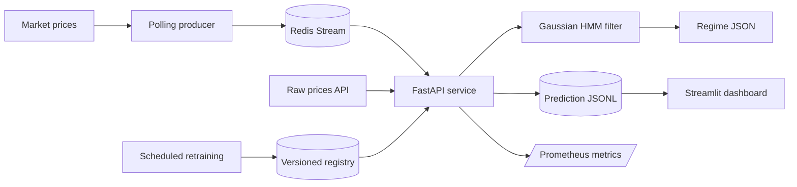

# Real-time Market Regime Detection

An installable Gaussian HMM service that converts market prices into features,
serves real-time regime probabilities, consumes Redis Streams, detects drift,
and retrains only after drift is detected. Candidates are promoted only when
they beat the active model on a held-out window.

## Architecture



## Local setup

```bash
pip install -e ".[dev]"
```

Train and register an initial model:

```bash
PYTHONPATH=src:. python jobs/train.py --model-dir models
```

Start the API:

```bash
PYTHONPATH=src:. uvicorn api.main:app --reload
```

The service does not retrain during prediction. Stateless requests are isolated;
callers that need continuous filtering provide a stable `series_id`. Retraining
is performed by the scheduler after a PSI or likelihood drift signal. A
candidate is promoted only when its per-observation held-out log-likelihood is
at least as good as the active model. The API watches the registry and loads a
newly promoted model without manual intervention.

## API

- `GET /api/v1/health`: liveness check
- `GET /api/v1/ready`: readiness and active model version
- `GET /api/v1/model`: model metadata
- `POST /api/v1/predict`: predict from feature vectors
- `POST /api/v1/predict/prices`: preprocess raw prices and return predictions
- `POST /api/v1/predict/batch`: predict multiple feature vectors
- `POST /api/v1/drift/check`: PSI and optional likelihood drift report
- `POST /api/v1/admin/reload-model`: load `latest` immediately (requires the
  `ADMIN_TOKEN` environment variable and matching `X-Admin-Token` header)
- `GET /metrics`: Prometheus metrics

Raw-price request example:

```json
{
  "prices": [100, 101, 100.5, 102, 103, 102, 104, 105, 104, 106, 107, 108]
}
```

## Streaming and scheduling

Run a Redis-backed local stack:

```bash
docker compose up --build
```

Compose starts the API, Redis, price poller, scheduled retraining worker,
MLflow (port 5000), Prometheus, and Streamlit dashboard. The poller publishes
each new five-minute market bar once to the `market-observations` stream. To run
workers manually:

```bash
PYTHONPATH=src:. python jobs/poll.py --redis-url redis://localhost:6379/0
PYTHONPATH=src:. python jobs/scheduler.py --interval-hours 24
streamlit run dashboard.py
```

Each version contains portable `.npz` parameters and JSON metadata, while
`models/latest` is the atomic production pointer. Training runs, parameters,
metrics, promotion status, and portable model artifacts are also recorded in
MLflow. Set `MLFLOW_TRACKING_URI` to use a shared tracking server; otherwise
MLflow uses its local default store.

## Testing and CI

```bash
PYTHONPATH=src:. pytest
ruff check .
```

Tests cover synthetic regime recovery, EM convergence, numerical edge cases,
drift detection, API validation, raw-price preprocessing, and service health.
GitHub Actions runs the test and lint commands on every push and pull request.
