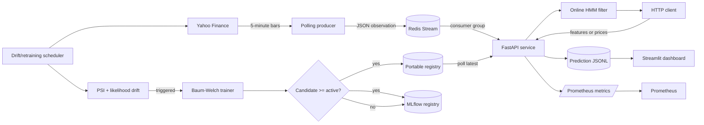
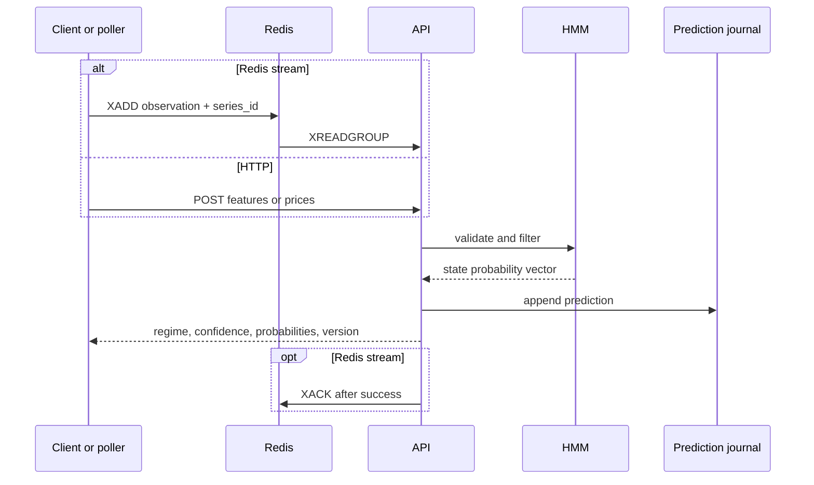
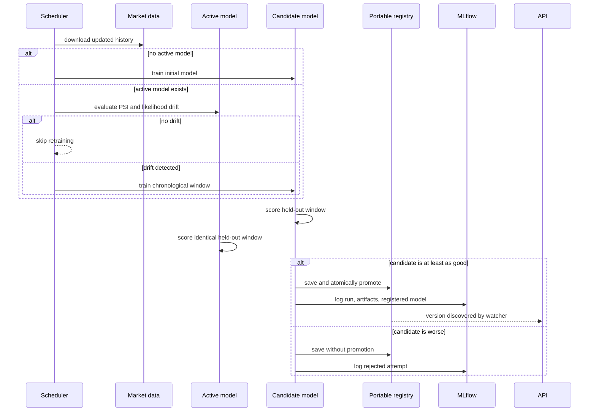

# Real-time Market Regime Detection

A production-oriented Gaussian Hidden Markov Model (HMM) system for learning latent market regimes from returns and volatility, serving online regime probabilities, consuming live observations, detecting drift, retraining safely, and exposing the lifecycle through APIs and operational tooling.

> [!IMPORTANT]
> This project is an engineering and statistical-learning demonstration. Its outputs are not investment advice, execution signals, or a guarantee that future market behavior will resemble fitted historical regimes.

## Table of contents

- [What the system does](#what-the-system-does)
- [Architecture](#architecture)
- [Repository layout](#repository-layout)
- [Mathematical model](#mathematical-model)
- [Feature engineering](#feature-engineering)
- [Inference algorithms](#inference-algorithms)
- [Training with Baum-Welch](#training-with-baum-welch)
- [Drift detection and safe retraining](#drift-detection-and-safe-retraining)
- [Model registry and serialization](#model-registry-and-serialization)
- [Docker Compose quick start](#docker-compose-quick-start)
- [Compose services and networking](#compose-services-and-networking)
- [Local development](#local-development)
- [API reference](#api-reference)
- [Streaming ingestion](#streaming-ingestion)
- [Monitoring and observability](#monitoring-and-observability)
- [Configuration reference](#configuration-reference)
- [Testing and CI](#testing-and-ci)
- [Operational runbook](#operational-runbook)
- [Failure behavior](#failure-behavior)
- [Security considerations](#security-considerations)
- [Scaling the design](#scaling-the-design)
- [Troubleshooting](#troubleshooting)
- [Known limitations](#known-limitations)

## What the system does

The project turns a Gaussian HMM implementation into a continuously operable service:

1. Historical closing prices are downloaded and converted to log-return and rolling-volatility features.
2. A diagonal-covariance Gaussian HMM learns persistent latent states by expectation-maximization.
3. With two states, the state with the lower fitted mean return is labeled `Bear` and the other `Bull`.
4. The API serves stateless predictions or maintains independent online filter state for named series.
5. A poller publishes each newly observed five-minute market bar to a Redis Stream.
6. The API consumes the stream with a Redis consumer group and recovers stale pending messages.
7. A scheduler evaluates feature-distribution and model-likelihood drift before deciding whether to retrain.
8. A candidate is promoted only if its held-out, per-observation log-likelihood is at least as good as the active model's score on the same data.
9. Parameters are saved as portable NumPy and JSON artifacts; runs and promoted models are also tracked in MLflow.
10. Prometheus, structured logs, a prediction journal, and a Streamlit dashboard expose service and model behavior.

The model does **not** place orders, manage a portfolio, forecast returns, or claim that a state is directly tradeable. A regime is a probabilistic description of the feature-generating process.

### Key design properties

- **Chronological validation:** the final 20% of observations are held out; time is never randomly shuffled.
- **Safe promotion:** retraining does not imply promotion.
- **Drift-gated automation:** scheduled checks can skip unnecessary retraining.
- **Stateless by default:** ordinary HTTP requests cannot contaminate one another's filter state.
- **Explicit stateful streams:** a stable `series_id` opts a caller into sequential filtering.
- **Portable models:** serving does not depend on Python pickle.
- **Stable inference:** scaled forward-backward and log-domain Viterbi avoid ordinary long-sequence underflow.
- **Observable operation:** latency, request status, regimes, drift, readiness, confidence, and rolling proportions are visible.
- **Recoverable ingestion:** Redis messages are acknowledged only after successful processing; stale pending work is reclaimed.

## Architecture

### System context



### Online inference sequence



### Retraining and promotion sequence



### Component responsibilities

| Component | Responsibility | Persistent state |
|---|---|---|
| FastAPI | Validation, filtering, model reload, HTTP API | In-memory state per `series_id` |
| Poller | Fetch market bars and publish unseen bars | Last timestamp in memory |
| Redis | Buffer observations and coordinate delivery | Stream and pending entries |
| Scheduler | Check drift, train, validate, promote | Registries only |
| Portable registry | Store exact parameters and production pointer | `./models` bind mount |
| MLflow | Experiments, metrics, artifacts, model versions | Named Docker volume |
| Prometheus | Scrape API operational metrics | Container-local TSDB |
| Streamlit | Display regime distribution and confidence | Reads prediction JSONL |

## Repository layout

```text
market_regime_hmm/
├── api/main.py                  # FastAPI app, schemas, state, metrics
├── jobs/
│   ├── poll.py                  # Yahoo Finance -> Redis producer
│   ├── scheduler.py             # Periodic drift/retraining process
│   └── train.py                 # One-shot manual training command
├── src/regime_detection/
│   ├── model.py                 # GaussianHMM implementation
│   ├── features.py              # Price loading and features
│   ├── validation.py            # Training/convergence validation
│   ├── drift.py                 # PSI and likelihood drift
│   ├── retraining.py            # Training, gating, labels, MLflow
│   ├── registry.py              # Portable versioned registry
│   ├── ingestion.py             # Redis Streams consumer
│   ├── monitoring.py            # Prediction journal
│   └── metrics.py               # Prometheus definitions
├── tests/                        # Numerical and integration-oriented tests
├── dashboard.py                 # Streamlit monitoring UI
├── Dockerfile                   # Shared application image
├── docker-compose.yml           # Seven-service local stack
├── prometheus.yml               # Prometheus scrape configuration
├── pyproject.toml                # Package/tool configuration
├── requirements.txt             # Container dependencies
└── .dockerignore                # Reproducible, small build context
```

## Mathematical model

### Notation and assumptions

Let $T$ be the number of observations, $K$ the number of states, $D$ the number of features, $x_t\in\mathbb{R}^D$ the feature vector, and $z_t\in\{1,\ldots,K\}$ the latent regime. Define

$$
\pi_i=P(z_1=i),\qquad A_{ij}=P(z_{t+1}=j\mid z_t=i),
$$

and let $\mu_i,\Sigma_i$ describe state $i$'s Gaussian emission. The parameters are

$$
\theta=\left(\pi,A,\{\mu_i,\Sigma_i\}_{i=1}^K\right).
$$

The first-order Markov and conditional-independence assumptions are

$$
P(z_t\mid z_{1:t-1})=P(z_t\mid z_{t-1}),
$$

$$
P(x_t\mid x_{1:t-1},z_{1:t})=P(x_t\mid z_t).
$$

Therefore

$$
P(x_{1:T},z_{1:T})=
\pi_{z_1}p(x_1\mid z_1)
\prod_{t=2}^{T}A_{z_{t-1},z_t}p(x_t\mid z_t).
$$

### Diagonal Gaussian emissions

The implementation assumes

$$
p(x_t\mid z_t=i)=\mathcal{N}(x_t;\mu_i,\operatorname{diag}(\sigma_i^2)),
$$

so the density is

$$
b_i(x_t)=
\frac{1}{\sqrt{(2\pi)^D\prod_{d=1}^D\sigma_{id}^2}}
\exp\left[-\frac12\sum_{d=1}^D
\frac{(x_{td}-\mu_{id})^2}{\sigma_{id}^2}\right].
$$

Diagonal covariance is easier to estimate reliably than a full covariance matrix with limited state-specific data. A regularizer $\varepsilon=10^{-6}$ is added to variances so the density remains defined when a state nearly collapses onto one value.

Transition initialization favors persistence with $A_{ii}=0.9$ and distributes the remainder across other states. Baum-Welch subsequently learns the matrix; the initial value is not a fixed regime-duration assumption.

## Feature engineering

The default vector is

$$
x_t=\begin{bmatrix}r_t&v_t\end{bmatrix}^{\top},
$$

with continuously compounded return

$$
r_t=\log\left(\frac{P_t}{P_{t-1}}\right)
$$

and ten-observation rolling sample volatility

$$
v_t=\sqrt{\frac{1}{w-1}\sum_{j=0}^{w-1}
(r_{t-j}-\bar r_{t,w})^2},\qquad w=10.
$$

Consequences:

- At least $w+1=11$ prices are needed for one complete feature row.
- The initial return and incomplete volatility windows are dropped.
- Prices must be positive and finite because of the logarithm.
- Timestamps must match prices and be unique and strictly increasing.
- Features are not standardized; means and variances remain in their natural units.

The poller requests five days of five-minute data, recomputes these features, and publishes only a bar newer than the last one published by that process.

## Inference algorithms

### Scaled forward algorithm

The unscaled forward probability is $\alpha_t(i)=P(x_{1:t},z_t=i\mid\theta)$. Direct products underflow on long sequences, so each step is normalized:

$$
\tilde\alpha_1(i)=\pi_i b_i(x_1),\quad
c_1=\sum_i\tilde\alpha_1(i),\quad
\hat\alpha_1(i)=\frac{\tilde\alpha_1(i)}{c_1},
$$

$$
\tilde\alpha_t(j)=b_j(x_t)\sum_i\hat\alpha_{t-1}(i)A_{ij},
$$

$$
c_t=\sum_j\tilde\alpha_t(j),\quad
\hat\alpha_t(j)=\frac{\tilde\alpha_t(j)}{c_t}.
$$

The log-likelihood is recovered as

$$
\log P(x_{1:T}\mid\theta)=\sum_{t=1}^T\log c_t.
$$

`score(X)` returns this total. Promotion divides it by $T$ to compare per-observation scores.

### Scaled backward algorithm and smoothing

Starting with $\hat\beta_T(i)=1$:

$$
\hat\beta_t(i)=
\frac{\sum_jA_{ij}b_j(x_{t+1})\hat\beta_{t+1}(j)}{c_{t+1}}.
$$

The smoothed state posterior is

$$
\gamma_t(i)=P(z_t=i\mid x_{1:T},\theta)=
\frac{\hat\alpha_t(i)\hat\beta_t(i)}
{\sum_j\hat\alpha_t(j)\hat\beta_t(j)}.
$$

`predict_proba(X)` returns $\gamma_t$. Because it is smoothed, an early row can use later evidence in the same input sequence.

### Online filtering

Live inference cannot use future values. Given filtered state $q_{t-1}$:

$$
q_t(j)\propto b_j(x_t)\sum_iq_{t-1}(i)A_{ij}.
$$

For a new sequence:

$$
q_1(j)\propto\pi_jb_j(x_1).
$$

The API uses filtering. Without `series_id`, each request begins from $\pi$. With `series_id`, the final $q_t$ becomes that series' next prior. The API retains a bounded least-recently-used set of 1,000 series by default.

### Viterbi decoding

`predict(X)` finds the single most probable path. In log space:

$$
\delta_1(j)=\log\pi_j+\log b_j(x_1),
$$

$$
\delta_t(j)=\max_i[\delta_{t-1}(i)+\log A_{ij}]+\log b_j(x_t).
$$

Maximizing predecessors are stored and followed backward. Logs turn products into sums and prevent underflow.

## Training with Baum-Welch

Baum-Welch is expectation-maximization for HMMs.

### E-step

In addition to $\gamma_t(i)$, compute expected transition occupancy

$$
\xi_t(i,j)=P(z_t=i,z_{t+1}=j\mid x_{1:T},\theta)
=\frac{\hat\alpha_t(i)A_{ij}b_j(x_{t+1})\hat\beta_{t+1}(j)}{c_{t+1}}.
$$

### M-step

$$
\pi_i^{\text{new}}=\gamma_1(i),
$$

$$
A_{ij}^{\text{new}}=
\frac{\sum_{t=1}^{T-1}\xi_t(i,j)}
{\sum_{t=1}^{T-1}\gamma_t(i)},
$$

$$
\mu_i^{\text{new}}=
\frac{\sum_{t=1}^T\gamma_t(i)x_t}{\sum_{t=1}^T\gamma_t(i)},
$$

$$
(\sigma_i^2)^{\text{new}}=
\frac{\sum_{t=1}^T\gamma_t(i)(x_t-\mu_i)^2}
{\sum_{t=1}^T\gamma_t(i)}+\varepsilon.
$$

Training stops after at most 200 iterations or when the absolute likelihood change is below $10^{-5}$. Tests assert monotonic EM likelihood up to numerical tolerance and more than 99% recovery in the seeded synthetic scenario, accounting for arbitrary label permutation.

The initial distribution is uniform; means are sampled deterministically from observations; every state starts with the global diagonal variance. Since HMM state numbers are not identifiable, two-state models are labeled after fitting: lower mean `LogReturn` becomes `Bear`, the other `Bull`. More than two states retain neutral names such as `State0`.

## Drift detection and safe retraining

### Population Stability Index

Reference quantiles define bins. Infinite outer bounds ensure values beyond historical extrema are included. For smoothed reference/current bin proportions $e_b,a_b$:

$$
\operatorname{PSI}=\sum_b(a_b-e_b)\log\left(\frac{a_b}{e_b}\right).
$$

The implementation adds $10^{-6}$ to counts before normalization. A feature drifts when PSI is at least `0.2` by default; the overall feature score is the maximum feature PSI.

### Likelihood degradation

Let $\bar\ell_{\mathrm{ref}}$ be mean historical per-observation log-likelihood, $s_{\mathrm{ref}}$ its sample standard deviation, and $\bar\ell_{\mathrm{cur}}$ the current mean:

$$
z=\frac{\bar\ell_{\mathrm{ref}}-\bar\ell_{\mathrm{cur}}}
{\max(s_{\mathrm{ref}},10^{-12})}.
$$

Likelihood drift occurs at $z\ge2$ by default. PSI and likelihood signals are joined with OR, so either can trigger retraining.

Each model stores up to the final 1,000 training rows, per-observation scores over 50-row chunks, selected quantiles, and the drift report that caused retraining. An older model without a compatible baseline is treated as drifted so it can be upgraded.

### Chronological validation and promotion

Without shuffling:

$$
X_{\mathrm{train}}=x_{1:\lfloor0.8T\rfloor},\qquad
X_{\mathrm{val}}=x_{\lfloor0.8T\rfloor+1:T}.
$$

Candidate and active model score the same validation rows. Promotion requires

$$
\frac{\log P(X_{\mathrm{val}}\mid\theta_{\mathrm{candidate}})}{|X_{\mathrm{val}}|}
\ge
\frac{\log P(X_{\mathrm{val}}\mid\theta_{\mathrm{active}})}{|X_{\mathrm{val}}|}.
$$

A rejected candidate remains saved and logged, but `latest` does not change.

## Model registry and serialization

```text
models/
├── 20260915T040923476988Z/
│   ├── parameters.npz
│   └── metadata.json
└── latest -> 20260915T040923476988Z
```

`parameters.npz` contains $\pi$, $A$, means, and diagonal variances. `metadata.json` contains configuration, features, labels, scores, dates, drift baseline, promotion status, and MLflow run ID.

Loading validates shapes, finiteness, non-negative probabilities, positive variances, and normalization. Promotion creates a temporary symlink and atomically replaces `latest`, so readers see a complete old or new model.

Every candidate creates an MLflow run with parameters, metrics, tags, and portable artifacts. Promoted candidates are also logged as MLflow PyFunc models and registered as `market-regime-hmm` unless overridden. The API checks `latest` every five seconds, swaps the model under a lock, and clears prior series states so probabilities never cross model versions.

## Docker Compose quick start

### Prerequisites

- Docker Engine with Compose v2
- Internet access for image build and Yahoo Finance
- Approximately 2 GB free Docker storage
- Default host ports 8000, 5001, 6379, 8501, and 9090, or overrides below

### Start everything

```bash
docker compose up --build -d
docker compose ps
```

The first build is sizable because one shared image contains API, training, MLflow, and Streamlit dependencies. Later builds reuse layers. `.dockerignore` excludes virtual environments, Git history, models, logs, tests, and caches.

On a clean first start:

1. Redis and MLflow become healthy.
2. The API starts live but initially has no model.
3. The scheduler immediately trains and promotes an initial model.
4. The API loads it within `MODEL_RELOAD_SECONDS`.
5. `/api/v1/ready` changes from HTTP 503 to 200.

```bash
watch -n 2 'curl -i http://localhost:8000/api/v1/ready'
```

### Service URLs

| Service | Default URL | Purpose |
|---|---|---|
| API | <http://localhost:8000> | Predictions and administration |
| OpenAPI | <http://localhost:8000/docs> | Interactive API documentation |
| MLflow | <http://localhost:5001> | Experiments and registry |
| Streamlit | <http://localhost:8501> | Prediction dashboard |
| Prometheus | <http://localhost:9090> | Metrics and queries |
| Redis | `localhost:6379` | Stream inspection/local clients |

MLflow remains port 5000 inside Compose and defaults to 5001 on the host to avoid a common macOS conflict.

### Override host ports

Create `.env` or export values:

```dotenv
API_PORT=18000
MLFLOW_PORT=15001
REDIS_PORT=16379
DASHBOARD_PORT=18501
PROMETHEUS_PORT=19090
```

Internal service DNS and ports do not change.

### Stop the stack

Preserve all volumes:

```bash
docker compose down
```

Delete the MLflow named volume intentionally:

```bash
docker compose down --volumes
```

The latter is destructive to MLflow history. Compose does not delete bind-mounted `./models` or `./var`.

## Compose services and networking

Application roles share `market-regime-hmm:local`. Only `api` owns the build definition; `up --build` builds that tag before other roles start.

| Service | Command/image | Dependency | Health check |
|---|---|---|---|
| `api` | Uvicorn | healthy Redis | API liveness |
| `redis` | `redis:7-alpine` | none | `redis-cli ping` |
| `scheduler` | `jobs/scheduler.py` | healthy MLflow | process state |
| `poller` | `jobs/poll.py` | healthy Redis | process state |
| `mlflow` | MLflow server | none | `/health` |
| `prometheus` | `prom/prometheus:v2.54.1` | API started | built-in readiness |
| `dashboard` | Streamlit | none | HTTP UI |

Container URLs use service names: `redis://redis:6379/0` and `http://mlflow:5000`. MLflow explicitly permits its internal hostname and configured localhost port, satisfying DNS-rebinding protection without wildcard Host headers.

Storage:

- `./models:/app/models` is shared by scheduler and API.
- `./var:/app/var` is shared by API and dashboard.
- `mlflow-data:/mlflow` stores MLflow SQLite and artifacts.
- Redis and Prometheus storage is ephemeral in this local Compose file.

## Local development

Python 3.11+ is required; CI and containers use 3.13.

```bash
python3 -m venv .venv
source .venv/bin/activate
python -m pip install --upgrade pip
python -m pip install -e '.[dev]'
```

Train manually:

```bash
python jobs/train.py \
  --ticker '^GSPC' --start 2005-01-01 --end 2024-01-01 \
  --states 2 --model-dir models
```

Manual training bypasses the drift gate but retains the validation promotion gate. Without `MLFLOW_TRACKING_URI`, MLflow uses its local default store.

Run the API without streaming:

```bash
MODEL_DIR=models uvicorn api.main:app --reload
```

Run supporting jobs:

```bash
python jobs/poll.py --redis-url redis://localhost:6379/0 \
  --ticker '^GSPC' --period 5d --market-interval 5m \
  --interval-seconds 300

MLFLOW_TRACKING_URI=http://localhost:5001 \
python jobs/scheduler.py --interval-hours 24 --ticker '^GSPC' \
  --start 2005-01-01 --states 2 --model-dir models

streamlit run dashboard.py
```

## API reference

FastAPI exposes `/openapi.json` and Swagger UI at `/docs`.

### Status conventions

- `400`: malformed types, non-finite values, wrong dimensions, insufficient prices, bad timestamps, or invalid drift arrays.
- `401`: missing/incorrect administrative token when reload is enabled.
- `404`: reload requested but no model exists.
- `503`: inference has no loaded model, or manual reload is disabled.

### Health, readiness, and model

`GET /api/v1/health` is process liveness:

```json
{"status":"ok","model_version":"20260915T040923476988Z"}
```

`model_version` is `null` before first load. `GET /api/v1/ready` returns 200 with `{"ready":true,"model_version":"..."}` or 503 with `{"ready":false}`. `GET /api/v1/model` returns version, ordered feature names, and state count.

### Predict one engineered observation

Stateless:

```bash
curl -X POST http://localhost:8000/api/v1/predict \
  -H 'Content-Type: application/json' \
  -d '{"features":[0.0012,0.0095],"timestamp":"2026-09-15T00:00:00Z"}'
```

Stateful:

```bash
curl -X POST http://localhost:8000/api/v1/predict \
  -H 'Content-Type: application/json' \
  -d '{"features":[-0.0041,0.0132],"timestamp":"2026-09-15T00:05:00Z","series_id":"SPY-5m"}'
```

```json
{
  "model_version":"20260915T040923476988Z",
  "timestamp":"2026-09-15T00:05:00Z",
  "state":0,
  "regime":"Bear",
  "probabilities":[0.8731,0.1269],
  "confidence":0.8731,
  "latency_ms":0.34
}
```

`confidence` is the returned state's posterior mass, not a confidence interval or probability of a profitable trade.

### Predict a batch

`POST /api/v1/predict/batch` treats observations as one ordered sequence. With default `reset:true`, it begins from $\pi$ and stores no state.

```json
{
  "reset":true,
  "observations":[
    {"features":[0.0012,0.0095]},
    {"features":[-0.0041,0.0132]}
  ]
}
```

With `reset:false`, every observation must use the same non-empty `series_id`; the batch continues and updates that series.

### Predict from raw prices

`POST /api/v1/predict/prices` requires at least 11 finite, positive prices:

```bash
curl -X POST http://localhost:8000/api/v1/predict/prices \
  -H 'Content-Type: application/json' \
  -d '{"prices":[100,101,100.5,102,103,102,104,105,104,106,107,108]}'
```

It returns one prediction per complete volatility window; this example produces two.

### Check drift

`POST /api/v1/drift/check` computes PSI and optional likelihood drift:

```json
{
  "reference":[[0.001,0.01],[-0.002,0.012],[0.003,0.009]],
  "current":[[0.010,0.03],[-0.015,0.04],[0.012,0.035]],
  "threshold":0.2,
  "reference_loglik":[2.1,2.0,2.2],
  "current_loglik":[0.4,0.5],
  "likelihood_threshold":2.0
}
```

The endpoint reports drift and updates the Prometheus gauge; it does not start retraining.

### Reload manually

Automatic reload normally makes this unnecessary. Set `ADMIN_TOKEN` and call:

```bash
curl -X POST http://localhost:8000/api/v1/admin/reload-model \
  -H "X-Admin-Token: $ADMIN_TOKEN"
```

It is disabled with 503 when no token is configured. Never commit the token.

### Metrics

```bash
curl http://localhost:8000/metrics
```

## Streaming ingestion

The default stream is `market-observations`, group `regime-api`, consumer `api`. The `payload` field contains:

```json
{"features":[0.0012,0.0095],"timestamp":"2026-09-15T00:05:00+00:00","series_id":"^GSPC"}
```

The API uses `XREADGROUP`, validates and predicts, journals the result, then acknowledges. Unacknowledged messages idle for 60 seconds are reclaimed through `XAUTOCLAIM`.

```bash
docker compose exec redis redis-cli XLEN market-observations
docker compose exec redis redis-cli XINFO GROUPS market-observations
docker compose exec redis redis-cli XPENDING market-observations regime-api
```

The duplicate guard is in memory; restarting the poller may republish the latest bar once. Strict exactly-once consumers should persist source event IDs.

## Monitoring and observability

| Metric | Type | Labels | Meaning |
|---|---|---|---|
| `regime_api_requests_total` | Counter | method, path, status | Completed HTTP requests |
| `regime_api_request_latency_seconds` | Histogram | path | Request latency |
| `regime_predictions_total` | Counter | state, model_version | Predictions by state/version |
| `regime_drift_score` | Gauge | none | Latest API drift score |
| `regime_active_model` | Gauge | none | 1 when loaded |

PromQL examples:

```promql
sum by (status) (rate(regime_api_requests_total[5m]))
```

```promql
histogram_quantile(0.95, sum by (le) (rate(regime_api_request_latency_seconds_bucket[5m])))
```

Every prediction is appended to `var/predictions.jsonl` with version, timestamp, state, label, probabilities, confidence, and processing latency. Streamlit shows total predictions, latest regime, rolling proportions, and confidence over time.

```bash
docker compose logs -f api scheduler poller
docker compose logs --since 10m mlflow redis prometheus dashboard
```

## Configuration reference

### API environment

| Variable | Default | Meaning |
|---|---|---|
| `MODEL_DIR` | `models` | Portable registry root |
| `MODEL_RELOAD_SECONDS` | `5` | Registry polling interval |
| `SERIES_STATE_LIMIT` | `1000` | Retained online series |
| `REDIS_URL` | unset | Enables stream consumer |
| `REDIS_STREAM` | `market-observations` | Stream key |
| `REDIS_GROUP` | `regime-api` | Consumer group |
| `REDIS_CONSUMER` | `api` | Consumer name |
| `PREDICTION_LOG` | `var/predictions.jsonl` | Journal path |
| `ADMIN_TOKEN` | unset | Enables manual reload |

### MLflow environment

| Variable | Default | Meaning |
|---|---|---|
| `MLFLOW_TRACKING_URI` | local store | Tracking server/store |
| `MLFLOW_EXPERIMENT` | `market-regime-hmm` | Experiment name |
| `MLFLOW_REGISTERED_MODEL` | `market-regime-hmm` | Registered model name |

### Host ports

| Variable | Default | Container port |
|---|---:|---:|
| `API_PORT` | 8000 | 8000 |
| `MLFLOW_PORT` | 5001 | 5000 |
| `REDIS_PORT` | 6379 | 6379 |
| `DASHBOARD_PORT` | 8501 | 8501 |
| `PROMETHEUS_PORT` | 9090 | 9090 |

Poller flags: `--redis-url`, `--stream`, `--ticker`, `--interval-seconds`, `--period`, `--market-interval`.

Scheduler flags: `--interval-hours`, `--model-dir`, `--ticker`, `--start`, `--states`.

Training flags: `--ticker`, `--start`, `--end`, `--model-dir`, `--states`.

## Testing and CI

```bash
pytest
ruff check .
python -m compileall -q src api jobs dashboard.py
```

Coverage includes finite likelihoods, normalized posteriors, >99% synthetic recovery, monotonic EM, degenerate/extreme data, request isolation, stateful series, malformed API input, price/timestamp validation, PSI outer ranges, likelihood drift, retraining gating, serialization integrity, registry promotion, poller deduplication, health, and reload security.

GitHub Actions installs `.[dev]`, runs pytest, and runs Ruff on pushes and pull requests under Python 3.13.

Container checks:

```bash
docker compose config --quiet
docker compose build api
docker compose exec -T api python -m compileall -q src api jobs dashboard.py
```

## Operational runbook

### Status and readiness

```bash
docker compose ps
curl -fsS http://localhost:8000/api/v1/health
curl -fsS http://localhost:8000/api/v1/ready
curl -fsS http://localhost:5001/health
curl -fsS http://localhost:9090/-/ready
```

### Inspect active model

```bash
curl -fsS http://localhost:8000/api/v1/model
readlink models/latest
python -m json.tool models/latest/metadata.json
```

### Force one-shot training

```bash
docker compose run --rm scheduler \
  python jobs/train.py --model-dir /app/models --ticker '^GSPC'
```

This bypasses drift gating but preserves validation gating.

### Restart or rebuild

```bash
docker compose restart api poller scheduler
docker compose build api
docker compose up -d --force-recreate
```

### Verify Prometheus target

```bash
curl -fsS 'http://localhost:9090/api/v1/query?query=up%7Bjob%3D%22regime-api%22%7D'
```

For a consistent MLflow SQLite backup, stop MLflow before copying its named-volume contents. Portable model versions are ordinary files; the atomic `latest` link always points to a complete version.

## Failure behavior

| Failure | Expected behavior |
|---|---|
| No model on first boot | Health 200; readiness/prediction 503 until training |
| Redis unavailable | HTTP service remains available; stream failure is logged |
| Stream handler fails | Message remains pending and is reclaimable after 60 seconds |
| Yahoo Finance fails | Poller warns and retries after its interval |
| No drift | Scheduler skips training until the next interval |
| Candidate underperforms | Candidate recorded; active pointer unchanged |
| New model promoted | API loads it and clears series states |
| Invalid model artifact | Loader rejects it; current loaded model remains |
| MLflow unavailable | Attempt logs an exception; portable artifacts remain inspectable |
| Empty journal | Dashboard displays an informational state |

## Security considerations

This Compose stack is for local development and portfolio demonstration, not direct public exposure.

- Manual reload is disabled unless `ADMIN_TOKEN` is configured; comparison is timing-safe.
- MLflow permits only its internal hostname and configured localhost addresses.
- Models use NumPy/JSON rather than pickle for the portable serving path.
- Inputs are dimension- and finiteness-checked.
- Published services have no TLS or end-user authentication.
- Never expose Redis, MLflow, Prometheus, Streamlit, or the API directly to an untrusted network.
- Production deployment should add an authenticated TLS proxy, private networks, secret management, alerting, and pinned/scanned dependencies.

## Scaling the design

| Current | Scaled alternative |
|---|---|
| One Uvicorn process | Replicated stateless API pods |
| In-process series state | External keyed state or event replay |
| JSONL journal | Database, object storage, or event bus |
| Filesystem pointer | Object store or managed registry alias |
| SQLite MLflow | PostgreSQL and durable object storage |
| Redis Stream | Managed Redis or partitioned Kafka |
| Local Prometheus | Managed metrics, alerts, long retention |
| Single poller | Partitioned producers with source event IDs |
| Python scheduling loop | CronJob or workflow scheduler |

With multiple API replicas, in-memory `series_id` state is unsafe because sequential calls may reach different workers. Send enough history for stateless filtering, use sticky routing, or externalize state with concurrency control.

## Troubleshooting

### Port conflict

```bash
MLFLOW_PORT=15001 API_PORT=18000 docker compose up -d
```

### Health is 200 but readiness is 503

The process is alive but no model is loaded. On first boot, wait for training and inspect:

```bash
docker compose logs --tail=200 scheduler api mlflow
ls -la models
```

### MLflow says `Invalid Host header`

Use `http://localhost:${MLFLOW_PORT:-5001}` from the host and `http://mlflow:5000` inside Compose. Compose adds the configured localhost port to the allowed-host list.

### Poller appears quiet

Success is intentionally quiet; outside market hours the latest bar does not change.

```bash
docker compose logs --tail=100 poller
docker compose exec redis redis-cli XLEN market-observations
```

### Feature-count errors

Check `/api/v1/model`. The default ordered vector is `[LogReturn, Volatility]`; the API cannot infer names from an unlabelled vector.

### Candidate did not activate

Inspect its `metadata.json`. `promoted:false` means its held-out score was worse; this is intended.

### Dashboard is empty

Confirm the API and dashboard share `./var`, then submit a prediction or check stream acknowledgements.

### Docker sends a large context

Confirm `.dockerignore` exists and run:

```bash
docker compose build --no-cache --progress=plain api
```

The `load build context` line should exclude virtual environments, models, logs, caches, and Git history.

## Known limitations

- Yahoo Finance is demonstration data, not guaranteed low-latency market data.
- Diagonal Gaussian emissions omit heavy tails and within-state feature covariance.
- Mean-return labels oversimplify high-volatility rallies and low-volatility drawdowns.
- State count is fixed rather than selected by AIC, BIC, or economic utility.
- Promotion uses held-out likelihood, not backtest returns, costs, or calibration.
- Provider corrections can revise recently downloaded bars.
- Series state disappears on process restart or model reload.
- Poller duplicate state is in memory, so restart can republish the latest bar once.
- Redis and Prometheus storage are ephemeral in the supplied Compose file.
- JSONL is not a transactional multi-writer datastore.
- Scheduler failures retry at the next configured interval; production should add alerts and a shorter failure retry policy.

These are explicit boundaries of the implementation, not assumptions to hide when interpreting its output.
